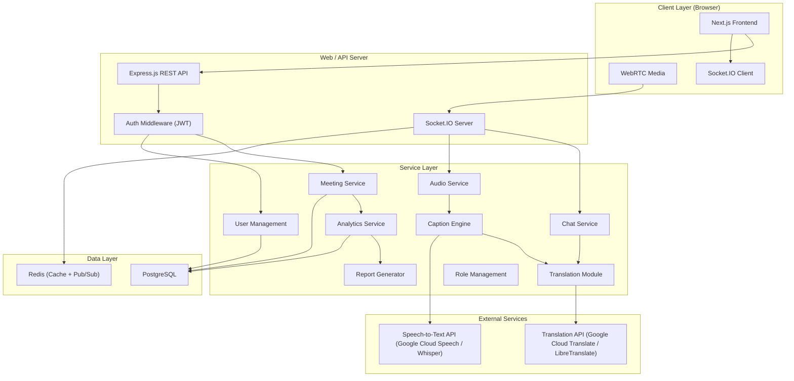
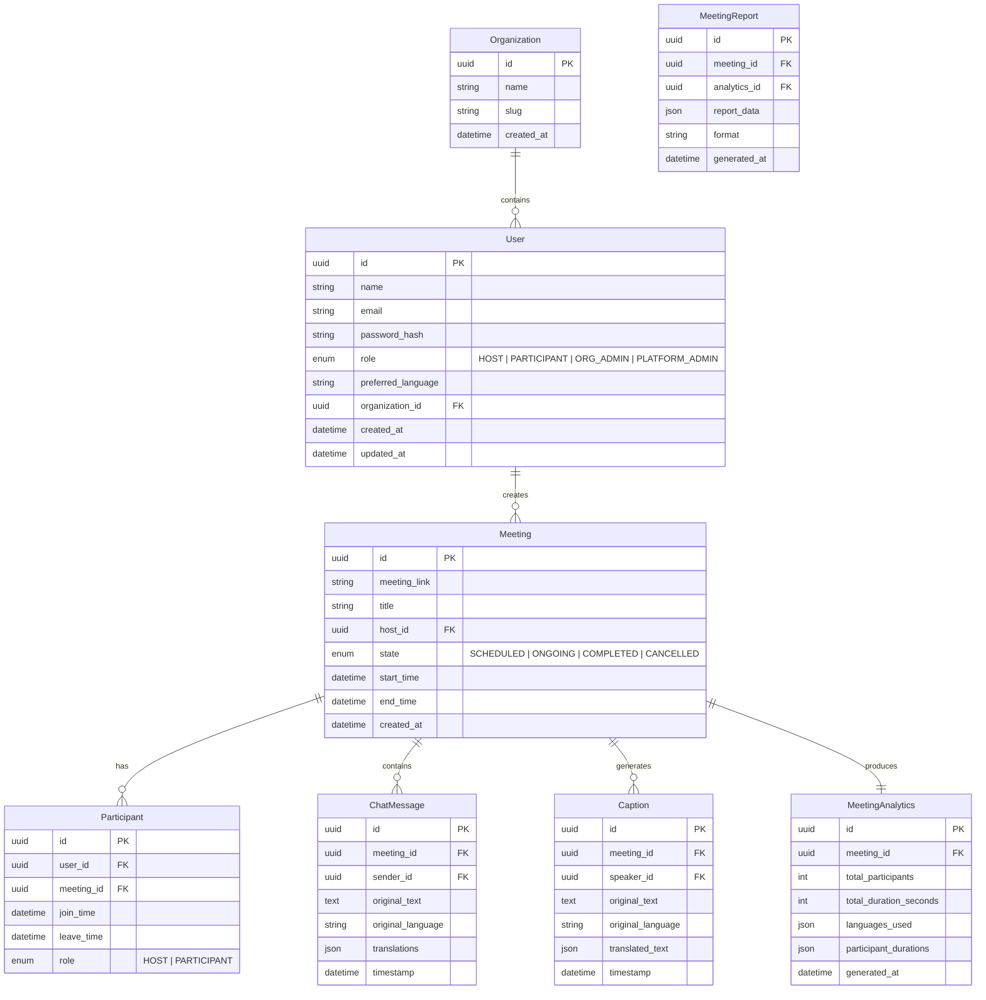

# BhashaBridge — Implementation Plan

> **Multilingual Real-Time Meeting Platform**
> *Team: Lazy Legends (Divyansh Nagar, Aditya Kumar, Shlok Deshmukh, Ashutosh Shukla)*

---

## 1. Project Overview

BhashaBridge is a web-based multilingual meeting platform that integrates **real-time translation** into video/audio communication. It enables users from different linguistic backgrounds to interact seamlessly via chat and audio with automatic translation, live captions, and meeting analytics.

### Core Value Proposition
- **Language-agnostic meetings** — participants communicate in their preferred language
- **Optional translation layer** — translation features can be toggled on/off per user
- **Meeting intelligence** — automatic analytics and report generation
- **Role-based administration** — Organization Admins and Platform Admins with distinct responsibilities

---

## 2. Architecture Overview



### Deployment Architecture (from Report)

| Layer | Technology | Purpose |
|-------|-----------|---------|
| **Client Devices** | Browser (Chrome/Firefox/Edge) | Host, Participant, Org Admin, Platform Admin UIs |
| **Web Server** | Nginx + Next.js | Static assets, SSR, reverse proxy |
| **Application Server** | Node.js + Express + Socket.IO | REST API, WebSocket handling, business logic |
| **Database Server** | PostgreSQL + Redis | Persistent data + real-time caching/pub-sub |
| **External Services** | Google Cloud APIs / LibreTranslate | Translation API + Speech-to-Text API |

---

## 3. Technology Stack

### Frontend
| Technology | Purpose |
|-----------|---------|
| **Next.js 14 (App Router)** | React framework with SSR/SSG, routing, API routes |
| **TypeScript** | Type safety across the codebase |
| **Socket.IO Client** | Real-time bidirectional communication |
| **WebRTC (simple-peer)** | Peer-to-peer audio/video streaming |
| **Zustand** | Lightweight state management |
| **CSS Modules + CSS Variables** | Scoped styling with design tokens |

### Backend
| Technology | Purpose |
|-----------|---------|
| **Node.js + Express** | REST API server |
| **TypeScript** | Type safety |
| **Socket.IO** | Real-time events (chat, captions, signaling) |
| **Prisma ORM** | Database access with type-safe queries |
| **PostgreSQL** | Primary relational database |
| **Redis** | Session caching, pub/sub for real-time events |
| **JWT + bcrypt** | Authentication & password hashing |
| **Zod** | Runtime request validation |

### External APIs
| Service | Options |
|---------|---------|
| **Translation** | Google Cloud Translate v3 (primary) or LibreTranslate (self-hosted fallback) |
| **Speech-to-Text** | Google Cloud Speech-to-Text or OpenAI Whisper API |

---

## 4. Data Model (from Class Diagram in Report)



### Enumerations (from Report)
- **UserRole**: `HOST`, `PARTICIPANT`, `ORG_ADMIN`, `PLATFORM_ADMIN`
- **MeetingState**: `SCHEDULED`, `ONGOING`, `COMPLETED`, `CANCELLED`
- **Language**: `en`, `hi`, `es`, `fr`, `de`, `ja`, `zh`, `ar`, `pt`, `ru` (extensible)

---

## 5. Feature Breakdown & Module Design

### 5.1 Authentication Module
- **Register** — email/password signup with preferred language selection
- **Login/Logout** — JWT-based sessions with refresh tokens
- **Profile Update** — change name, preferred language, password
- **Password Reset** — email-based recovery flow

### 5.2 Meeting Module (Core)
- **Create Meeting** — host creates meeting, gets shareable link
- **Join Meeting** — participants join via link or meeting ID
- **Meeting Lobby** — pre-join screen to configure audio/video/language
- **Start/End Meeting** — host controls meeting lifecycle
- **Participant Management** — add/remove participants, view participant list
- **Meeting States** — `SCHEDULED → ONGOING → COMPLETED` (or `CANCELLED`)

### 5.3 Chat Module
- **Send Message** — real-time chat via Socket.IO
- **Message Translation** (optional, `<<extend>>` from report)
  - When enabled, messages are auto-translated to each participant's preferred language
  - Original + translations stored together
- **Message History** — persisted per meeting

### 5.4 Audio/Video Module
- **WebRTC Peer Connections** — audio/video streaming via `simple-peer`
- **Signaling Server** — Socket.IO-based WebRTC signaling
- **Audio Controls** — mute/unmute, volume control
- **Video Controls** — camera on/off, screen sharing

### 5.5 Caption Engine (from Report)
- **Live Captions** (optional, `<<extend>>`) — speech-to-text via Speech API
- **Caption Translation** (optional, `<<extend>>`) — translated captions in preferred language
- **Audio Translation** (optional, `<<extend>>`) — spoken audio translated and delivered to listeners
- Pipeline: `Audio → Speech-to-Text → Caption → Translation → Display/Audio Output`

### 5.6 Translation Module
- **Text Translation** — translate chat messages and captions
- **Language Detection** — auto-detect source language
- **Supported Languages** — configurable, extensible list
- **Service Interface** — `ITranslationService` abstraction for swappable providers

### 5.7 Analytics Module
- **Calculate Total Participants** (`<<include>>`) — count unique participants
- **Calculate Total Duration** (`<<include>>`) — meeting start-to-end duration + per-participant duration
- **Languages Used** — track which languages were active
- **Auto-generated** at meeting end

### 5.8 Report Generator
- **Generate Meeting Report** (`<<include>>`) — PDF/JSON report from analytics
- **Report Contents** — participants, duration, language stats, chat summary
- **Service Interface** — `IReportGenerator` abstraction

### 5.9 Admin Modules

#### Organization Admin
- **User Management** — add/remove users in organization
- **Role Management** — assign roles (Host, Participant)
- **Organization Settings** — configure org defaults

#### Platform Admin
- **System Monitor** — system health, active meetings, resource usage
- **Service Manager** — enable/disable translation, reporting services
- **Platform-wide Settings** — manage supported languages, API keys

---

## 6. Real-Time Communication Design

### Socket.IO Events

| Event | Direction | Purpose |
|-------|-----------|---------|
| `meeting:join` | Client → Server | Join a meeting room |
| `meeting:leave` | Client → Server | Leave meeting |
| `chat:message` | Bidirectional | Send/receive chat messages |
| `chat:translated` | Server → Client | Translated message delivery |
| `caption:text` | Server → Client | Live caption text |
| `caption:translated` | Server → Client | Translated caption |
| `audio:signal` | Bidirectional | WebRTC signaling |
| `participant:joined` | Server → Client | New participant notification |
| `participant:left` | Server → Client | Participant left notification |
| `meeting:ended` | Server → Client | Meeting terminated by host |

### WebRTC Flow
1. User joins meeting → Socket.IO connection established
2. Server notifies existing participants of new peer
3. Existing peers initiate WebRTC offers via signaling
4. ICE candidates exchanged through Socket.IO
5. Direct peer-to-peer media streams established

---

## 7. API Design (REST Endpoints)

### Auth
| Method | Endpoint | Description |
|--------|----------|-------------|
| POST | `/api/auth/register` | Register new user |
| POST | `/api/auth/login` | Login, returns JWT |
| POST | `/api/auth/logout` | Invalidate session |
| POST | `/api/auth/refresh` | Refresh access token |
| POST | `/api/auth/forgot-password` | Request password reset |

### Users
| Method | Endpoint | Description |
|--------|----------|-------------|
| GET | `/api/users/me` | Get current user profile |
| PATCH | `/api/users/me` | Update profile |
| GET | `/api/users/:id` | Get user by ID (admin) |

### Meetings
| Method | Endpoint | Description |
|--------|----------|-------------|
| POST | `/api/meetings` | Create meeting |
| GET | `/api/meetings` | List user's meetings |
| GET | `/api/meetings/:id` | Get meeting details |
| PATCH | `/api/meetings/:id` | Update meeting (host) |
| POST | `/api/meetings/:id/join` | Join a meeting |
| POST | `/api/meetings/:id/end` | End meeting (host) |
| GET | `/api/meetings/:id/participants` | Get participants |

### Analytics & Reports
| Method | Endpoint | Description |
|--------|----------|-------------|
| GET | `/api/meetings/:id/analytics` | Get meeting analytics |
| POST | `/api/meetings/:id/report` | Generate report |
| GET | `/api/meetings/:id/report` | Download report |

### Admin
| Method | Endpoint | Description |
|--------|----------|-------------|
| GET | `/api/admin/org/users` | List org users |
| POST | `/api/admin/org/users` | Add user to org |
| DELETE | `/api/admin/org/users/:id` | Remove user from org |
| PATCH | `/api/admin/org/users/:id/role` | Change user role |
| GET | `/api/admin/platform/health` | System health |
| GET | `/api/admin/platform/services` | List services |
| PATCH | `/api/admin/platform/services/:id` | Toggle service |

### Translation
| Method | Endpoint | Description |
|--------|----------|-------------|
| POST | `/api/translate` | Translate text |
| GET | `/api/languages` | List supported languages |

---

## 8. Folder Structure

```
BhashaBridge/
├── README.md
├── .gitignore
├── .env.example
├── docker-compose.yml
├── docs/
│   ├── REPORT_BHASHABRIDGE_.pdf
│   ├── api-spec.md
│   └── architecture.md
│
├── frontend/
│   ├── package.json
│   ├── tsconfig.json
│   ├── next.config.js
│   ├── .env.local.example
│   ├── public/
│   │   ├── favicon.ico
│   │   ├── logo.svg
│   │   └── images/
│   ├── src/
│   │   ├── app/
│   │   │   ├── layout.jsx                    # Root layout with providers
│   │   │   ├── page.jsx                      # Landing / home page
│   │   │   ├── globals.css                   # Global styles + design tokens
│   │   │   ├── (auth)/
│   │   │   │   ├── login/page.jsx
│   │   │   │   ├── register/page.jsx
│   │   │   │   └── forgot-password/page.jsx
│   │   │   ├── dashboard/
│   │   │   │   ├── page.jsx                  # User dashboard
│   │   │   │   └── layout.jsx
│   │   │   ├── meeting/
│   │   │   │   ├── create/page.jsx           # Create meeting
│   │   │   │   ├── [id]/
│   │   │   │   │   ├── page.jsx              # Meeting room
│   │   │   │   │   ├── lobby/page.jsx        # Pre-join lobby
│   │   │   │   │   └── report/page.jsx       # Post-meeting report
│   │   │   ├── admin/
│   │   │   │   ├── layout.jsx
│   │   │   │   ├── org/
│   │   │   │   │   ├── users/page.jsx        # Org user management
│   │   │   │   │   └── roles/page.jsx        # Role management
│   │   │   │   └── platform/
│   │   │   │       ├── dashboard/page.jsx    # System monitoring
│   │   │   │       └── services/page.jsx     # Service management
│   │   │   └── profile/
│   │   │       └── page.jsx                  # User profile settings
│   │   │
│   │   ├── components/
│   │   │   ├── ui/                           # Reusable UI primitives
│   │   │   │   ├── Button.jsx
│   │   │   │   ├── Input.jsx
│   │   │   │   ├── Modal.jsx
│   │   │   │   ├── Card.jsx
│   │   │   │   ├── Badge.jsx
│   │   │   │   ├── Dropdown.jsx
│   │   │   │   ├── Toast.jsx
│   │   │   │   └── Loader.jsx
│   │   │   ├── layout/
│   │   │   │   ├── Header.jsx
│   │   │   │   ├── Sidebar.jsx
│   │   │   │   ├── Footer.jsx
│   │   │   │   └── Navigation.jsx
│   │   │   ├── auth/
│   │   │   │   ├── LoginForm.jsx
│   │   │   │   ├── RegisterForm.jsx
│   │   │   │   └── AuthGuard.jsx
│   │   │   ├── meeting/
│   │   │   │   ├── MeetingRoom.jsx           # Main meeting container
│   │   │   │   ├── VideoGrid.jsx             # Video tiles layout
│   │   │   │   ├── VideoTile.jsx             # Individual video
│   │   │   │   ├── MeetingControls.jsx       # Mute, camera, leave, etc.
│   │   │   │   ├── ParticipantList.jsx
│   │   │   │   ├── MeetingLobby.jsx
│   │   │   │   └── MeetingCard.jsx           # Meeting preview card
│   │   │   ├── chat/
│   │   │   │   ├── ChatPanel.jsx             # Chat sidebar
│   │   │   │   ├── ChatMessage.jsx           # Single message
│   │   │   │   ├── ChatInput.jsx             # Message input
│   │   │   │   └── TranslatedMessage.jsx     # Message with translations
│   │   │   ├── caption/
│   │   │   │   ├── CaptionOverlay.jsx        # Live caption display
│   │   │   │   ├── CaptionSettings.jsx       # Caption preferences
│   │   │   │   └── TranslatedCaption.jsx
│   │   │   ├── analytics/
│   │   │   │   ├── AnalyticsDashboard.jsx
│   │   │   │   ├── ParticipantChart.jsx
│   │   │   │   └── LanguageStats.jsx
│   │   │   └── admin/
│   │   │       ├── UserTable.jsx
│   │   │       ├── RoleEditor.jsx
│   │   │       ├── ServiceStatusCard.jsx
│   │   │       └── SystemHealthMonitor.jsx
│   │   │
│   │   ├── hooks/
│   │   │   ├── useAuth.ts
│   │   │   ├── useMeeting.ts
│   │   │   ├── useSocket.ts
│   │   │   ├── useWebRTC.ts
│   │   │   ├── useChat.ts
│   │   │   ├── useCaptions.ts
│   │   │   ├── useTranslation.ts
│   │   │   └── useMediaDevices.ts
│   │   │
│   │   ├── stores/
│   │   │   ├── authStore.ts
│   │   │   ├── meetingStore.ts
│   │   │   ├── chatStore.ts
│   │   │   └── captionStore.ts
│   │   │
│   │   ├── services/
│   │   │   ├── api.ts                        # Axios/fetch instance
│   │   │   ├── authService.ts
│   │   │   ├── meetingService.ts
│   │   │   ├── chatService.ts
│   │   │   ├── translationService.ts
│   │   │   └── adminService.ts
│   │   │
│   │   ├── lib/
│   │   │   ├── socket.ts                     # Socket.IO client setup
│   │   │   ├── webrtc.ts                     # WebRTC helpers
│   │   │   ├── constants.ts
│   │   │   └── utils.ts
│   │   │
│   │   └── types/
│   │       ├── user.ts
│   │       ├── meeting.ts
│   │       ├── chat.ts
│   │       ├── caption.ts
│   │       ├── analytics.ts
│   │       └── admin.ts
│   │
│   └── tests/
│       ├── components/
│       └── hooks/
│
├── backend/
│   ├── package.json
│   ├── tsconfig.json
│   ├── .env.example
│   ├── prisma/
│   │   ├── schema.prisma                     # Database schema
│   │   ├── migrations/
│   │   └── seed.ts                           # Seed data
│   ├── src/
│   │   ├── index.ts                          # Entry point
│   │   ├── app.ts                            # Express app setup
│   │   ├── server.ts                         # HTTP + Socket.IO server
│   │   │
│   │   ├── config/
│   │   │   ├── database.ts
│   │   │   ├── redis.ts
│   │   │   ├── socket.ts
│   │   │   ├── cors.ts
│   │   │   └── env.ts                        # Environment variables validation
│   │   │
│   │   ├── middleware/
│   │   │   ├── auth.ts                       # JWT verification
│   │   │   ├── rbac.ts                       # Role-based access control
│   │   │   ├── validation.ts                 # Zod request validation
│   │   │   ├── errorHandler.ts               # Global error handler
│   │   │   └── rateLimiter.ts
│   │   │
│   │   ├── routes/
│   │   │   ├── index.ts                      # Route aggregator
│   │   │   ├── auth.routes.ts
│   │   │   ├── user.routes.ts
│   │   │   ├── meeting.routes.ts
│   │   │   ├── analytics.routes.ts
│   │   │   ├── translation.routes.ts
│   │   │   └── admin.routes.ts
│   │   │
│   │   ├── controllers/
│   │   │   ├── auth.controller.ts
│   │   │   ├── user.controller.ts
│   │   │   ├── meeting.controller.ts
│   │   │   ├── analytics.controller.ts
│   │   │   ├── translation.controller.ts
│   │   │   └── admin.controller.ts
│   │   │
│   │   ├── services/
│   │   │   ├── auth.service.ts
│   │   │   ├── user.service.ts
│   │   │   ├── meeting.service.ts
│   │   │   ├── chat.service.ts
│   │   │   ├── audio.service.ts
│   │   │   ├── caption.service.ts            # Speech-to-text engine
│   │   │   ├── translation.service.ts        # ITranslationService impl
│   │   │   ├── analytics.service.ts
│   │   │   ├── report.service.ts             # IReportGenerator impl
│   │   │   └── admin.service.ts
│   │   │
│   │   ├── interfaces/
│   │   │   ├── ITranslationService.ts
│   │   │   └── IReportGenerator.ts
│   │   │
│   │   ├── socket/
│   │   │   ├── index.ts                      # Socket.IO initialization
│   │   │   ├── handlers/
│   │   │   │   ├── meeting.handler.ts        # Meeting room events
│   │   │   │   ├── chat.handler.ts           # Chat message events
│   │   │   │   ├── audio.handler.ts          # Audio/signaling events
│   │   │   │   └── caption.handler.ts        # Caption stream events
│   │   │   └── middleware/
│   │   │       └── socketAuth.ts             # Socket authentication
│   │   │
│   │   ├── utils/
│   │   │   ├── logger.ts
│   │   │   ├── errors.ts                     # Custom error classes
│   │   │   ├── validators.ts                 # Zod schemas
│   │   │   └── helpers.ts
│   │   │
│   │   └── types/
│   │       ├── express.d.ts                  # Express type extensions
│   │       ├── socket.d.ts
│   │       └── enums.ts                      # UserRole, MeetingState, Language
│   │
│   └── tests/
│       ├── unit/
│       │   ├── services/
│       │   └── controllers/
│       ├── integration/
│       │   ├── auth.test.ts
│       │   ├── meeting.test.ts
│       │   └── translation.test.ts
│       └── setup.ts
│
└── shared/
    ├── package.json
    └── src/
        ├── types.ts                          # Shared TypeScript types
        ├── constants.ts                      # Shared constants
        ├── enums.ts                          # Shared enumerations
        └── validators.ts                     # Shared Zod schemas
```

---

## 9. Key Design Decisions

### 9.1 Interface-Based Service Design (from Report)
The report specifies `ITranslationService` and `IReportGenerator` interfaces. This allows:
- Swapping translation providers (Google Translate → LibreTranslate) without code changes
- Mock implementations for testing
- Future extensibility

### 9.2 Optional Features as Extensions (from Use Case Diagram)
The report uses `<<extend>>` relationships for:
- Message Translation (extends Send Chat Message)
- Live Caption (extends Speak Audio)
- Caption Translation (extends Live Caption)
- Audio Translation (extends Speak Audio)

**Implementation**: Each translation/caption feature is gated by user preferences stored in `User.preferred_language` and per-meeting settings. The frontend uses feature toggles.

### 9.3 Admin Separation (from Report)
Two admin types with distinct responsibilities:
- **Organization Admin** → User/Role management within their org
- **Platform Admin** → System-wide monitoring, service management

**Implementation**: RBAC middleware checks `UserRole` enum on each request.

---

## 10. Phased Development Roadmap

### Phase 1: Foundation (Week 1–2)
- [ ] Project scaffolding (Next.js + Express + Prisma)
- [ ] Database schema + migrations
- [ ] User authentication (register, login, JWT)
- [ ] Basic user profile management
- [ ] Landing page + auth pages UI

### Phase 2: Core Meeting (Week 3–4)
- [ ] Create / join / end meeting flow
- [ ] Meeting room UI (video grid, controls)
- [ ] WebRTC audio/video via simple-peer
- [ ] Socket.IO signaling server
- [ ] Participant management
- [ ] Dashboard with meeting list

### Phase 3: Chat & Translation (Week 5–6)
- [ ] Real-time chat via Socket.IO
- [ ] Translation service integration (Google Cloud Translate)
- [ ] Optional message translation
- [ ] Language selection UI
- [ ] Chat panel in meeting room

### Phase 4: Captions & Audio Translation (Week 7–8)
- [ ] Speech-to-text integration (Google Cloud Speech / Whisper)
- [ ] Live caption overlay
- [ ] Caption translation
- [ ] Audio translation pipeline
- [ ] Caption settings UI

### Phase 5: Analytics & Reports (Week 9)
- [ ] Meeting analytics calculation at meeting end
- [ ] Analytics dashboard component
- [ ] Report generation (PDF/JSON)
- [ ] Post-meeting report page

### Phase 6: Administration (Week 10)
- [ ] Organization admin dashboard
- [ ] User management (add/remove/roles)
- [ ] Platform admin dashboard
- [ ] System health monitoring
- [ ] Service management (toggle translation, reporting)

### Phase 7: Polish & Deploy (Week 11–12)
- [ ] UI/UX polish, responsive design, animations
- [ ] Error handling & edge cases
- [ ] Performance optimization (latency < 300ms target from SRS)
- [ ] Security audit (encrypted comms, auth hardening)
- [ ] Docker Compose setup
- [ ] Deployment documentation

---

## 11. User Review Required

> [!IMPORTANT]
> **Translation API Choice**: The report mentions using external Translation Services. The two main options are:
> - **Google Cloud Translate v3** — production-grade, paid, excellent quality
> - **LibreTranslate** — open-source, self-hosted, free but lower quality
>
> Which would you prefer as the primary provider? The interface design allows switching later.

> [!IMPORTANT]
> **Speech-to-Text Provider**: For live captions, the options are:
> - **Google Cloud Speech-to-Text** — real-time streaming, paid
> - **OpenAI Whisper API** — high quality, paid, batch-oriented
> - **Whisper.cpp (local)** — free, self-hosted, requires GPU for real-time
>
> Which approach should we use?

> [!IMPORTANT]
> **Video Conferencing Scope**: The report mentions both 1-to-1 calls (in the SRS summary) and group meetings (in the main body). Should we:
> - Start with **1-to-1 calls** and extend to groups later?
> - Build **group meetings** from the start using an SFU (Selective Forwarding Unit) like mediasoup?

---

## 12. Open Questions

> [!WARNING]
> **Database Choice**: The plan uses PostgreSQL. The report doesn't specify a particular database. Should we consider MongoDB for more flexible schema, or stick with PostgreSQL for relational integrity?

> [!NOTE]
> **Deployment Target**: Should we target Docker Compose for local/self-hosted deployment, or cloud services (Vercel for frontend, Railway/Render for backend)?

> [!NOTE]
> **Audio Translation Output**: The report mentions "real-time audio translation where spoken audio is directly translated and delivered to listeners." This implies text-to-speech synthesis of translated text. Should we implement TTS, or focus on translated captions only for the initial version?

---

## 13. Verification Plan

### Automated Tests
```bash
# Backend unit tests
cd backend && npm test

# Backend integration tests
cd backend && npm run test:integration

# Frontend component tests
cd frontend && npm test

# E2E tests
npx playwright test
```

### Manual Verification
- **Auth Flow**: Register → Login → Profile update → Logout
- **Meeting Flow**: Create meeting → Share link → Join → Chat → End
- **Translation**: Send message in English → Verify Hindi translation appears
- **Captions**: Speak → Verify live caption → Verify translated caption
- **Analytics**: End meeting → Verify analytics generated → Download report
- **Admin**: Org admin adds user → Platform admin monitors system health
- **Performance**: Measure translation latency (target < 300ms from SRS)
- **Cross-browser**: Test on Chrome, Firefox, Edge
